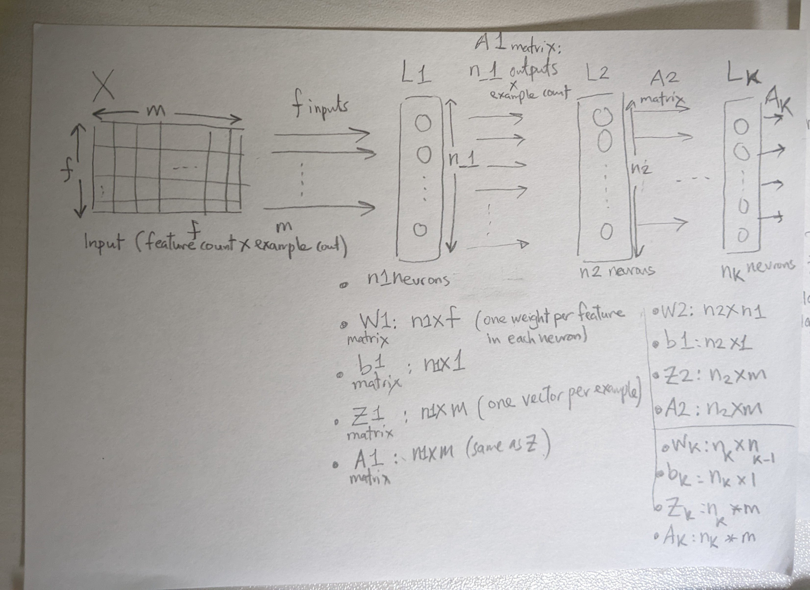
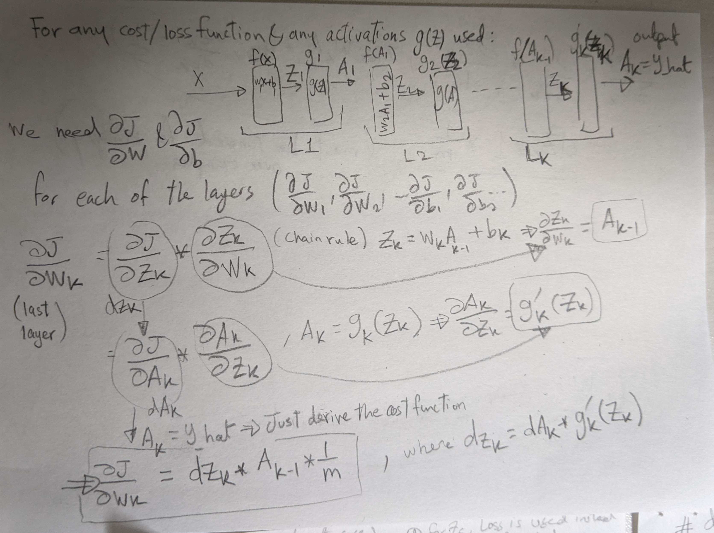
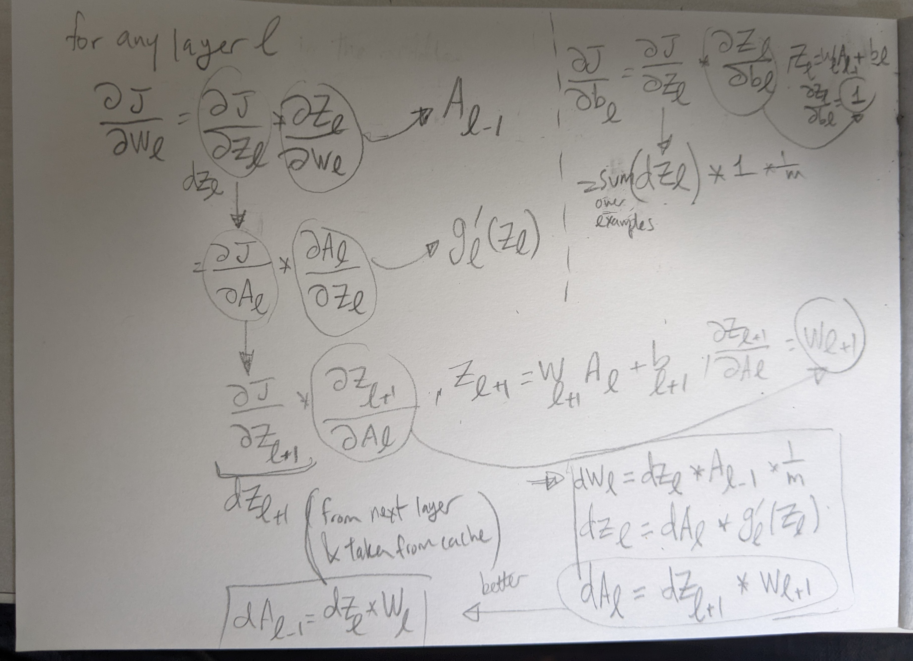
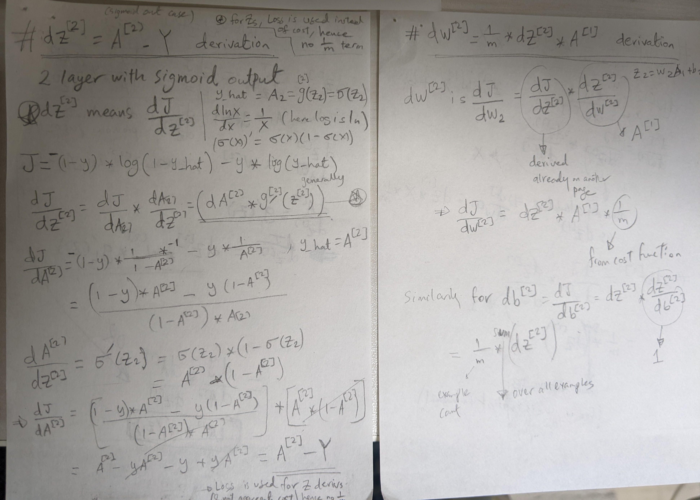
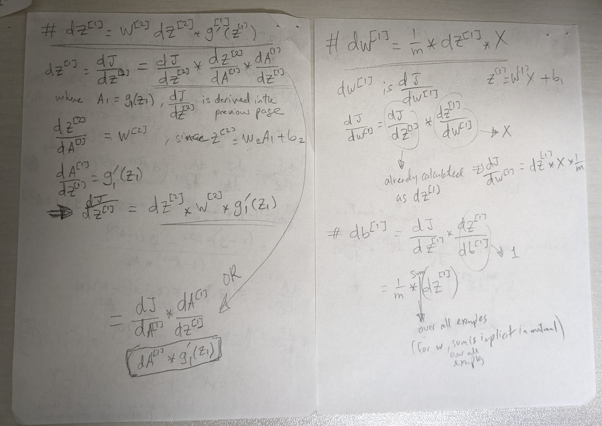

## Structure of a Neural Network and sizes of each element (as numpy arrays)

## Derivation of backprop equations, for a generic cost function J and activation functions g
- Final goal is to get `dW_l` (`∂J/∂W_l`) and `db_l` (`∂J/∂b_l`) for each layer `l` in order to update the W and b matrices in gradient descent
- Derivation can be done using the chain rule
- For Z matrices dZ_l(`∂J/∂Z_l`) is derived using the Loss function instead of the cost function, hence the absence of the `1/m` term.
### Last layer `K`:

### Any other layer `l` :

## Example with a 2-layer network:
2 layers with Linear --> Sigmoid activations

### Last layer (2)

### First layer (1)

